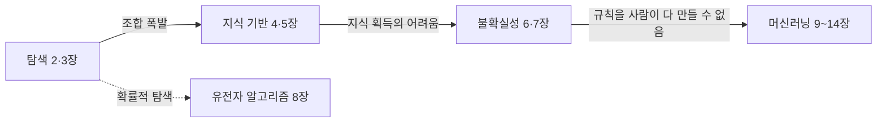

# Ch01. 인공지능 소개

> **핵심 질문**: 지능이란 무엇이고, 기계가 지능을 가졌는지 어떻게 판단하는가?
> 이 책의 1~14장은 그 답을 구현하려던 방법들이 시대 순으로 발전해 온 과정이다.

## 1. AI ⊃ ML ⊃ DL

| 구분 | 정의 | 판단 규칙의 출처 | 예 |
|---|---|---|---|
| AI | 지능적으로 보이는 행동을 하는 시스템 전체 | 사람이 직접 작성해도 됨 | A* 탐색, 전문가 시스템 |
| ML | 판단 규칙을 데이터에서 학습 | 데이터 | 선형 회귀, 결정 트리 |
| DL | 특징까지 데이터에서 추출하는 다층 신경망 | 데이터(특징 포함) | MNIST 신경망 |

- **구분 기준**: 규칙을 사람이 작성했나(AI) / 데이터에서 학습했나(ML) · 특징을 사람이 설계했나(ML) / 신경망이 추출했나(DL)
- **예외**: kNN은 별도의 학습 단계 없이 데이터를 저장만 한다. 그래도 판단이 데이터에서 나오므로 ML로 분류한다.
- **지능형 에이전트**: 센서로 환경을 지각 → 판단 → 행동으로 환경에 작용하는 주체

## 2. 튜링 테스트: 지능을 '행동'으로 판단

- **기준**: 대화만으로 사람과 구별할 수 없으면 지능이 있다고 본다 (행동주의적 관점)
- **ELIZA (1966)**: 단순한 패턴 매칭만으로 사람처럼 보였다
- **중국어 방 (Searle, 1980)**: 규칙표만 따라 답해도 이해는 없다 → 행동 ≠ 이해
- **유진 구스트만 (2014)**: '13세 소년'이라는 설정으로 심사위원 약 1/3을 속였다
- **한계**: 오늘날 LLM은 사실상 통과하지만 AGI로 보지 않는다 → 통과가 곧 지능은 아니다

## 3. 역사: 기대와 침체의 반복

| 시기 | 국면 | 침체 원인 / 동력 |
|---|---|---|
| 1943–1956 | 태동 | — |
| 1956–1974 | 황금기 | 조합 폭발, 계산 능력 한계 → 1차 AI 겨울 |
| 1980–1987 | 전성기 (전문가 시스템) | 지식 획득의 어려움, 유지 비용 → 2차 AI 겨울 |
| 1993–2011 | 부활 (통계적 방법) | — |
| 2011–현재 | 딥러닝 | 빅데이터 + GPU |

> 기존 방법이 한계에 부딪힐 때마다 새로운 방법이 등장했고, 이 책의 장 순서도 이 흐름을 따른다.

## 4. 이 책의 흐름

## 연습문제 풀이 (교재 p.69~)

> 문제 원문은 교재 참고. 아래는 직접 작성한 답안이다.

### 빈칸 (1~5)

| # | 주제 | 답 |
|---|---|---|
| 1 | 컴퓨터에 학습 능력을 부여하는 분야 | 머신러닝 |
| 2 | 다층 신경망을 위한 학습 알고리즘 | 딥러닝 |
| 3 | 전문가의 규칙으로 특정 영역 문제를 푸는 프로그램 | 전문가 시스템 |
| 4 | 환경을 감지하고 지능적으로 행동하는 SW/HW | 지능형 에이전트 |
| 5 | 사람과 구별 불가 시 지능으로 인정하는 테스트 | 튜링 테스트 |

### 6. 지능의 정의와 핵심 요소
새로운 상황에서 목표를 달성하기 위해 지식을 획득하고 활용하는 능력.
핵심 요소: 학습, 추론, 문제 해결, 지각, 언어 이해, 환경 적응.

### 7. "컴퓨터는 시키는 대로만 한다"는 주장
튜링이 '러브레이스 부인의 반론'으로 직접 다룬 주장이다.
머신러닝에서 프로그래머가 작성하는 것은 행동 자체가 아니라 **학습 규칙**이다.
행동은 데이터로부터 만들어지므로 설계자도 예측하지 못한 결과가 나온다
(예: 알파고의 '37수'는 개발자도 예상하지 못했다). 따라서 이 주장은 오늘날 성립하기 어렵다.

### 8. 컴퓨터가 아직 잘 못하는 문제
- 처음 보는 예외 상황 대응 (복잡한 시내 자율주행)
- 물리적 조작 (빨래 개기, 불규칙한 물체 집기) → 모라벡의 역설
- 상식·인과 추론, 사실 여부의 신뢰성 보장

### 9. 튜링 테스트와 그 타당성
질문자가 텍스트 대화만으로 상대가 사람인지 기계인지 구별하지 못하면
기계가 지능을 가졌다고 보는 테스트다 (1950년 제안).
- **타당한 면**: '지능'이라는 모호한 개념을 관찰 가능한 행동으로 바꿨다.
- **한계**: 행동이 같다고 이해까지 같은 것은 아니다 (중국어 방 논변).
  ELIZA나 유진 구스트만처럼 속임수로도 통과할 수 있다.
  오늘날 LLM은 사실상 통과하지만 범용 인공지능으로 보지 않는다.
- **결론**: 지능의 한 측면을 보는 지표일 뿐, 충분한 판정 기준은 아니다.

### 10. AI가 유용한 분야
의료 진단, 자율주행, 추천 시스템, 기계 번역, 금융 사기 탐지, 신약 개발.

### 11. 전문가 시스템 vs GPS
| | GPS (1950년대 말) | 전문가 시스템 |
|---|---|---|
| 목표 | 모든 문제를 푸는 범용 해결기 | 특정 영역 문제 해결 |
| 핵심 | 영역 독립적 탐색 (수단-목표 분석) | 전문가에게서 얻은 영역 지식(규칙) |

GPS는 범용성을 노리다가 실제 문제의 복잡도를 감당하지 못했다.
전문가 시스템은 영역을 좁히고 지식을 넣는 방향으로 전환한 것이다.

### 12. 인공 신경망의 첫 등장
1943년 매컬러-피츠의 인공 뉴런 모델. 학습 가능한 신경망은 1958년 로젠블랫의 퍼셉트론.

### 13. AI가 인간을 능가한 사건
- 1997 딥블루가 체스 세계 챔피언 카스파로프를 꺾음
- 2011 IBM 왓슨이 퀴즈쇼 제퍼디!에서 우승
- 2016 알파고가 이세돌 9단에게 4:1 승리

### 14. AI 활용의 구체적 사례
스마트폰 얼굴 인식 잠금, 메일 스팸 필터, 동영상 추천, 의료 영상 판독 보조, 공장 불량품 검사.